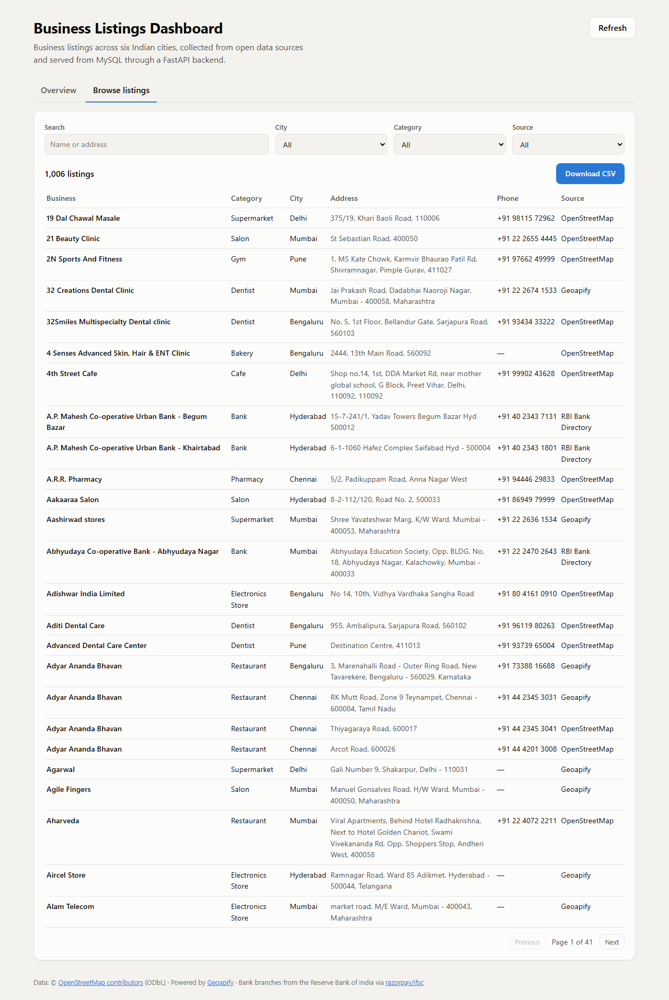
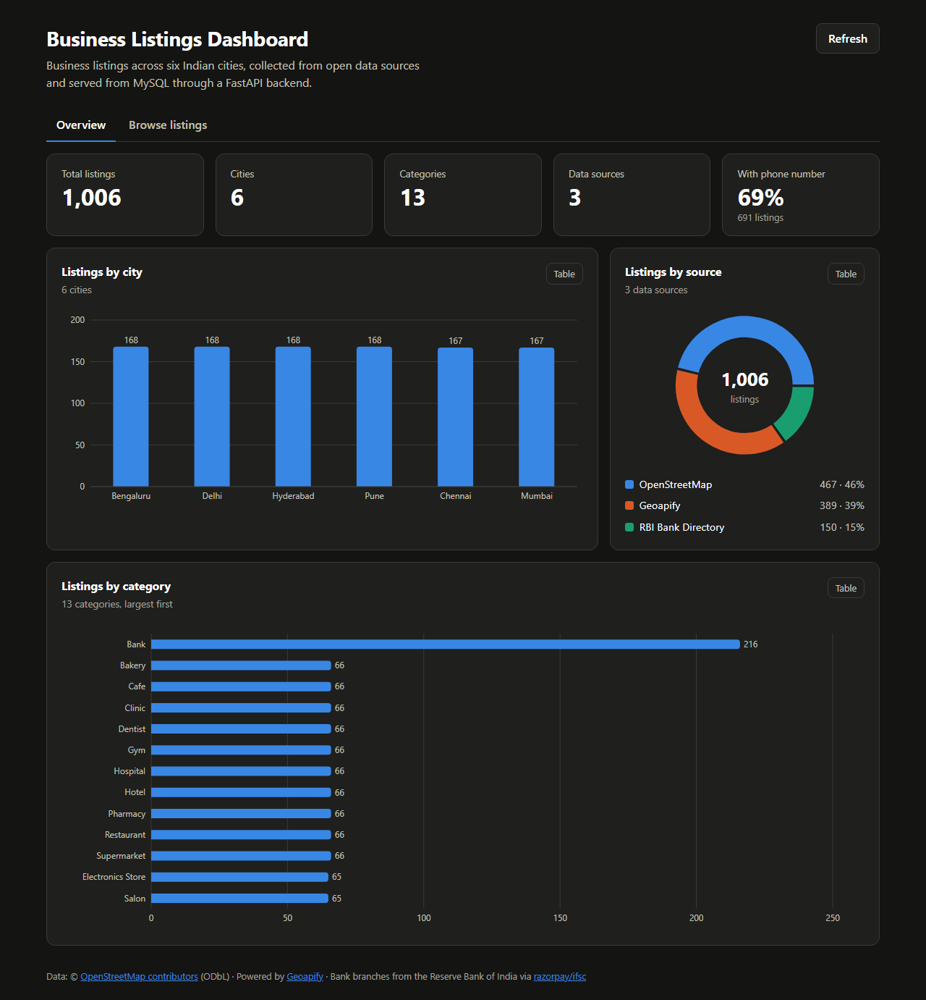
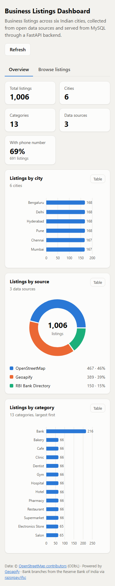
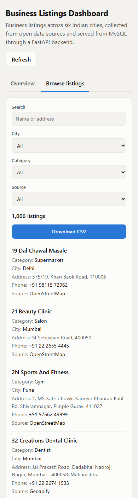
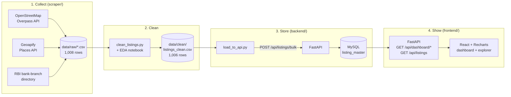

# Business Listings Dashboard

A full-stack data pipeline that **collects** business listings from open data sources, **cleans** and de-duplicates them, **stores** them in MySQL through a FastAPI bulk-insert API, and **visualises** city, category and source breakdowns in a React dashboard, with a searchable listings explorer and CSV download.

**1,006 listings** · **6 cities** (Mumbai, Delhi, Bengaluru, Chennai, Hyderabad, Pune) · **13 categories** · **3 sources**

**Live demo:** [honeybee-listings.vercel.app](https://honeybee-listings.vercel.app) · API docs: [honeybee-listings-api.onrender.com/docs](https://honeybee-listings-api.onrender.com/docs)
<sub>The API runs on a free plan that sleeps when idle: the first request after a quiet period can take up to a minute.</sub>


<details>
<summary>Listings explorer, dark mode and mobile screenshots</summary>

**Browse listings:** filter by city, category and source, search by name or address, download the result as CSV.





 
</details>

---

## Contents
- [Architecture](#architecture)
- [Tech stack](#tech-stack)
- [Data sources](#data-sources)
- [Repository structure](#repository-structure)
- [Setup](#setup)
- [API reference](#api-reference)
- [Database design](#database-design)
- [Data cleaning](#data-cleaning)
- [Testing](#testing)
- [Challenges faced](#challenges-faced)
- [Deployment](#deployment)
- [What I would do next](#what-i-would-do-next)

---

## Architecture



1. **Collect:** three collectors download listings into `data/raw/` with a common column layout.
2. **Clean:** one script standardises text and phone numbers, validates fields and removes duplicates; the notebook shows every step with before/after evidence.
3. **Store:** the loader sends the clean data **through the API** (not straight into MySQL), so every row passes the same validation and de-duplication a real client's data would.
4. **Show:** the *Overview* tab reads aggregated counts (MySQL does the counting with `GROUP BY` on indexed columns); the *Browse listings* tab pages through the stored rows with filters and exports them as CSV.

---

## Tech stack

| Layer | Technology |
|---|---|
| Frontend | React 19, Vite 8, Recharts 3 |
| Backend | FastAPI, SQLAlchemy 2, Pydantic v2, PyMySQL, Uvicorn |
| Database | MySQL 8+ (developed on 9.7), utf8mb4 |
| Data | Python 3.11+ (developed on 3.14), requests, pandas, Jupyter, matplotlib |
| Testing | pytest (46 tests), oxlint |

---

## Data sources

The brief lists Google Maps, Justdial and Sulekha, and also asks to *"avoid scraping in a way that violates website terms of service"*. I checked each platform's terms **before** collecting anything. All three (and five other Indian directories) prohibit scraping or republishing, so I used sources whose terms explicitly allow it:

| Source | Method | Licence / terms | Rows |
|---|---|---|---|
| **OpenStreetMap** | Official Overpass API (6 requests) | ODbL: free reuse with attribution | 467 |
| **Geoapify Places** | Official Places API (free key, ~156 credits) | Results may be cached, stored and redistributed | 389 |
| **RBI bank-branch directory** | Open dataset ([razorpay/ifsc](https://github.com/razorpay/ifsc)) | MIT | 150 |

Full evidence (quoted terms for every site considered) is in **[docs/DATA_SOURCES.md](docs/DATA_SOURCES.md)**. Collectors identify themselves with a descriptive User-Agent, pause between requests, and back off automatically on HTTP 429.

---

## Repository structure

```
backend/                 FastAPI application
  app/
    main.py              App setup, CORS, routers
    config.py            Settings from .env (pydantic-settings)
    database.py          SQLAlchemy engine and per-request session
    models.py            listing_master ORM model
    schemas.py           Pydantic request/response models
    dedupe.py            sha256 de-duplication key
    routers/             health.py, listings.py (bulk insert, browse, CSV export), dashboard.py (counts)
  tests/                 API tests (in-memory SQLite)
frontend/                React + Vite dashboard (see frontend/README.md)
scraper/                 Data pipeline
  osm_overpass.py        Collector 1: OpenStreetMap
  geoapify_places.py     Collector 2: Geoapify
  rbi_bank_branches.py   Collector 3: RBI bank directory
  clean_listings.py      Cleaning pipeline (raw -> clean CSV)
  load_to_api.py         Loader (clean CSV -> API -> MySQL)
  tests/                 Cleaning-rule tests
data/
  raw/                   Collector outputs (one CSV per source)
  clean/listings_clean.csv   Final cleaned dataset
notebooks/cleaning_eda.ipynb Cleaning walkthrough + exploratory analysis
database/
  schema.sql             Table definition
  listing_master_dump.sql    Full dump (1,006 rows)
docs/                    Data sources, design decisions, screenshots
```

---

## Setup

**Prerequisites:** Python 3.11+, Node.js 20+, MySQL 8+.
Commands below are for Windows PowerShell; on macOS/Linux use `venv/bin/python` instead of `venv\Scripts\python`.

### 1. Database

As a MySQL admin (e.g. in MySQL Workbench), create the database and an application user:

```sql
CREATE DATABASE honeybee_listings CHARACTER SET utf8mb4 COLLATE utf8mb4_unicode_ci;
CREATE USER 'listings_app'@'localhost' IDENTIFIED BY 'choose_a_password';
GRANT ALL PRIVILEGES ON honeybee_listings.* TO 'listings_app'@'localhost';
```

Then load the data. The quickest option restores the full dump (table + 1,006 rows):

```bash
mysql -u listings_app -p honeybee_listings < database/listing_master_dump.sql
```

<details>
<summary>Alternative: rebuild everything from the raw data</summary>

Create the empty table with `database/schema.sql`, start the backend (step 3), then run the pipeline (step 2): clean, then load through the API.
</details>

### 2. Configuration

```bash
cp .env.example .env          # Windows: copy .env.example .env
```
Set `MYSQL_PASSWORD` to the password you chose. `GEOAPIFY_API_KEY` is only needed to re-run the Geoapify collector.

### 3. Backend

```powershell
cd backend
python -m venv venv
venv\Scripts\python -m pip install -r requirements.txt
venv\Scripts\python -m uvicorn app.main:app --reload
```
API: http://localhost:8000 · Interactive docs: **http://localhost:8000/docs** · Health: http://localhost:8000/health

### 4. Frontend

In a second terminal:
```bash
cd frontend
npm install
npm run dev
```
Dashboard: **http://localhost:5173**

### 5. Data pipeline (optional: data is already included)

```powershell
cd scraper
python -m venv venv
venv\Scripts\python -m pip install -r requirements.txt
cd ..
scraper\venv\Scripts\python scraper\osm_overpass.py       # ~2 min
scraper\venv\Scripts\python scraper\geoapify_places.py    # ~3 min, needs GEOAPIFY_API_KEY
scraper\venv\Scripts\python scraper\rbi_bank_branches.py  # downloads 36 MB once
scraper\venv\Scripts\python scraper\clean_listings.py     # raw -> data/clean/listings_clean.csv
scraper\venv\Scripts\python scraper\load_to_api.py        # clean CSV -> API -> MySQL (backend must be running)
```
The loader is idempotent: running it again reports every row as skipped.

---

## API reference

| Method | Endpoint | Description |
|---|---|---|
| `GET` | `/health` | API status and database connectivity (503 if MySQL is unreachable) |
| `POST` | `/api/listings/bulk` | Validate and insert up to 1,000 listings in one transaction; duplicates skipped |
| `GET` | `/api/dashboard/cities` | Listing count per city |
| `GET` | `/api/dashboard/categories` | Listing count per category |
| `GET` | `/api/dashboard/sources` | Listing count per source |
| `GET` | `/api/dashboard/summary` | Totals for the KPI cards |
| `GET` | `/api/listings` | Browse stored listings: filters `city`, `category`, `source`, search `q` (name or address), `page`, `page_size` (≤ 100) |
| `GET` | `/api/listings/export.csv` | Download listings as CSV, with the same filters |

**Bulk insert:** request body is a JSON array of listings:
```json
[{"business_name": "Cafe Madras", "category": "Cafe", "city": "Mumbai",
  "address": "38-B King's Circle, Matunga East", "phone": "+91 22 2401 4419", "source": "OpenStreetMap"}]
```
Response: `{"received": 1, "inserted": 1, "skipped": 0}`. Invalid rows return **422** naming the field; a concurrent duplicate insert returns **409**.

**Counts** return `[{"label": "Bengaluru", "count": 168}, ...]`, sorted by count (ties alphabetical).
**Summary** returns `{"total_listings": 1006, "cities": 6, "categories": 13, "sources": 3, "with_phone": 691}`.
**Browse** returns `{"items": [...], "total": 14, "page": 1, "page_size": 25}`, sorted by business name.

---

## Database design

Table `listing_master` follows the suggested schema, plus a de-duplication key:

| Column | Type | Notes |
|---|---|---|
| `id` | BIGINT UNSIGNED, PK | Auto-increment |
| `business_name` | VARCHAR(255) | Required |
| `category` | VARCHAR(100) | Required, indexed |
| `city` | VARCHAR(100) | Required, indexed |
| `address` | VARCHAR(500) | Nullable |
| `phone` | VARCHAR(32) | Nullable, normalised `+91 …` |
| `source` | VARCHAR(50) | Required, indexed |
| `dedupe_key` | CHAR(64), UNIQUE | sha256 of normalised name + address + city + source |
| `created_at` | DATETIME | Defaults to insert time |

The UNIQUE `dedupe_key` lets the database itself guarantee no duplicates, even across repeated or concurrent loads. A hash is used because a unique index across several long utf8mb4 text columns would exceed MySQL's index size limit. The indexes on city, category and source back the dashboard's `GROUP BY` queries.

---

## Data cleaning

`scraper/clean_listings.py` applies eight reported steps; [`notebooks/cleaning_eda.ipynb`](notebooks/cleaning_eda.ipynb) walks through them with before/after tables and charts.

| Issue | Fix | Effect |
|---|---|---|
| 112 different phone formats, several numbers per field | First number kept; prefixes stripped (00, 91, 0); area code added to local numbers; must be 10 digits | 3 standard formats; 24 invalid numbers emptied, never guessed |
| ALL-CAPS bank names and addresses | Title-cased, keeping brands (OYO) and abbreviations (MW) | 162 names, 154 addresses |
| Redundant ", India", stray spaces and commas | Trimmed | 392 + 105 rows |
| Duplicates | Exact (same key) and cross-source (same name and city within 150 m) | 2 removed |
| Names in Indian scripts | English name preferred at collection time | 6 names |

**Result:** 1,006 rows, 99.6% with an address, 69% with a validated phone number.

**Known limitation:** categories come from each source's own tags and are not re-verified. Browsing the data shows a few mis-tagged places (e.g. a skin clinic tagged as a bakery in OpenStreetMap). Fixing these would need a name-based classifier or manual review.

---

## Testing

From the project root:
```powershell
# Backend API tests (first time: install the test tools)
backend\venv\Scripts\python -m pip install -r backend\requirements-dev.txt
cd backend; venv\Scripts\python -m pytest; cd ..

# Cleaning tests
cd scraper; venv\Scripts\python -m pytest; cd ..

# Frontend lint + production build
cd frontend; npm run lint; npm run build; cd ..
```
- **Backend (21 tests):** bulk insert, re-run idempotency, in-batch and case/spacing duplicates, validation errors, batch limit, dashboard counts and ordering, browse filters/search/pagination, CSV export, empty database. Runs on in-memory SQLite, so no MySQL is needed.
- **Cleaning (25 tests):** phone normalisation edge cases, invalid numbers, capitalisation rules, de-duplication.
- **End to end:** after loading, every dashboard endpoint was reconciled against counts computed from the CSV (all match), and the dump was verified by restoring it.

---

## Challenges faced

1. **The named platforms forbid scraping.** Justdial, Sulekha and Google Maps prohibit automated collection in their terms, and Justdial actively blocks bots. Rather than break the terms, I documented the evidence and used three legal sources (two official APIs and an MIT-licensed government dataset).
2. **Overlapping sources.** Geoapify builds much of its data on OpenStreetMap. The Geoapify collector matches records by OpenStreetMap id and skips 126 already collected, so the two sources share zero records.
3. **Misleading city data in the bank directory.** Small co-operative banks register through a sponsor bank's Mumbai office, so ~1,100 "banks" appeared in Mumbai. Requiring 15+ local branches, an address that matches the city (PIN prefix or name), and dropping toll-free/shared helpline numbers fixed it.
4. **Phone numbers in 112 formats**, including mixed prefixes (`+91 011 …`), multiple numbers and a spreadsheet-corrupted `1.13E+42`. A single normaliser with a strict "10 digits or empty" rule solved it without inventing data.
5. **Balanced, comparable charts.** OpenStreetMap returned 22,365 matches, Bengaluru alone 8,748. Collectors cap listings per city × category, so charts compare like with like (and the dashboard notes Bank is larger because one source is a bank directory).
6. **Rate limits and slow networks.** The Overpass API returned HTTP 429 twice; automatic back-off with retries handled it, and the 36 MB bank file is downloaded once into a git-ignored cache.
7. **Restorable dump with a least-privilege user.** MySQL 9 adds GTID and masking-policy statements that a non-admin user can't restore; the dump uses `--set-gtid-purged=OFF --skip-masking-policies`.

More detail on every design decision: [docs/DECISIONS.md](docs/DECISIONS.md).

---

## Deployment

| Part | Host | Notes |
|---|---|---|
| Frontend | Vercel | Root directory `frontend`; `VITE_API_BASE_URL` points at the API |
| API | Render (free web service) | Root directory `backend`; `uvicorn app.main:app --host 0.0.0.0 --port $PORT`; health check `/health` |
| Database | Aiven for MySQL (free) | TLS required: the CA certificate is provided as a Render secret file and passed via `MYSQL_SSL_CA`, so the API verifies the server certificate |

The hosted database was loaded by restoring `database/listing_master_dump.sql` over a verified TLS connection. `CORS_ORIGINS` on the API lists the Vercel domain.

---

## What I would do next

- **Category quality check:** flag listings whose name contradicts their category (e.g. "clinic" tagged as a bakery) for review.
- **Scheduled refresh:** run the collectors on a schedule (e.g. GitHub Actions) and load only new listings.
- **Fuzzy cross-source matching** on names and addresses (e.g. "Cafe Coffee Day" vs "CCD") to catch duplicates without coordinates.
- **Containerised setup:** Docker Compose (MySQL + API + frontend) for one-command local runs.
- **More cities and phone enrichment** for low-coverage categories such as bakeries (47% have a phone).

---

## Attribution

Map data © [OpenStreetMap contributors](https://www.openstreetmap.org/copyright) (ODbL) · Places data powered by [Geoapify](https://www.geoapify.com/) · Bank branch data from the Reserve Bank of India via [razorpay/ifsc](https://github.com/razorpay/ifsc) (MIT).
